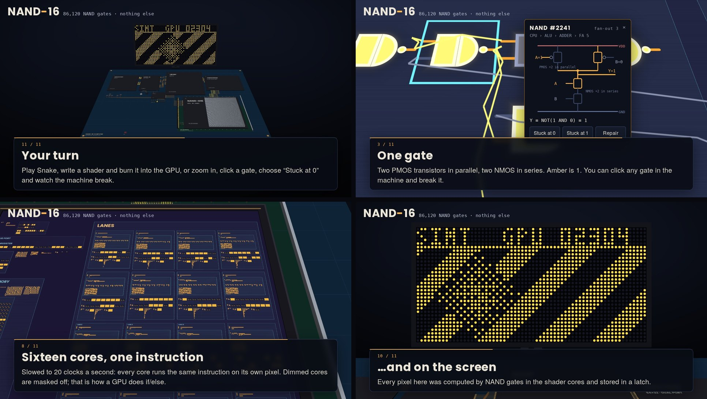

# NAND-16

**A complete computer made of 86,120 NAND gates. Nothing else.**

A 16-bit CPU, RAM, video RAM, a 16-core GPU, an assembler, a tiny operating system and Snake, all built from a single kind of part (the two-input NAND gate) and simulated gate by gate in your browser. You can play the game, then zoom from the circuit board through the chips down to one gate and watch the signals move while it runs.

**[▶ Try it in your browser](https://YOUR-NAME.github.io/nand16/)** · works best on a desktop · 中文说明见[下方](#中文说明)



## What is real

There is no CPU emulator and no instruction interpreter on the page. All the computing your browser does is this one line, applied over and over to every gate:

```js
nv = 1 ^ (v[ia[g]] & v[ib[g]]);   // the whole machine
```

The rest of the code builds the circuit, lays it out, and draws the voltage on every wire. Each clock cycle has four phases (CLK falls, PHI2 rises, PHI2 falls, CLK rises), and in every phase the gates keep switching until the whole circuit is quiet.

You can check it yourself: zoom into any gate, click it and choose **Stuck at 0**. Break a gate in the adder and the snake goes astray; break a latch in video RAM and that pixel never changes again.

## What is inside

| Part | NAND gates | What it is |
|---|---:|---|
| CPU | 3,421 | 16-bit, single cycle, 8 registers, ripple-carry ALU, barrel shifter, flags |
| Mask ROM | 21,359 | 1,625 words; the program *is* the wiring (a word line joins bit-plane *b* only if bit *b* is 1) |
| RAM | 30,416 | 256 × 16 bits, one 4-gate latch per bit |
| Video RAM | 15,876 | 64 × 32 pixels, dual-ported (CPU on port A, GPU on port B) |
| GPU (G16) | 14,213 | 16 SIMT shader cores with predicate masks, rasterizer, Bayer dithering, JTAG-style debug port |
| I/O | 668 | edge-triggered key latches, timer, random-number LFSR, LED port |
| Bus glue + clock | 167 | address decode, read mux, clock buffer |
| **Total** | **86,120** | |

On top of the hardware:

- **Assembler**: two passes, macros, local labels. NAND-OS and the games become 1,625 words that are wired into the ROM chip when the page opens.
- **NAND-OS**: boots from random power-on state, tests RAM, self-tests the GPU, then offers a menu. 13 system calls (plot, text with a 3×5 font stored as code, keys, timing, random numbers…).
- **Programs**: Snake, SKETCH, SYSTEM, and a GPU demo whose SIMT effect shows cores inside and outside a ball taking different branches.
- **Shader lab**: write a GPU program, and it is shifted bit by bit into the GPU through three debug pins (also gates), then runs on the next frame.
- **Gate-by-gate slow motion**, a **guided tour**, a **Chinese / English** interface, and a **soundtrack** whose melody is read off the ALU's output wires.

## How it was checked

During development the CPU and GPU were run in lockstep against an independent behavioural reference model (`test/ref.js`) and compared every cycle: registers, flags, memory, GPU state and shader memory. Run the checks yourself:

```sh
npm test        # or: node test/all.js
```

## Run it locally

No dependencies besides Node.js for building:

```sh
node build.js   # writes index.html (standalone) and dist/nand16.html
```

Then open `index.html` in a browser. It needs WebGL2.

## Layout

```
src/hdl.js       circuit builder; the only primitive is nand()
src/sim.js       gate simulator: unit-delay event-driven and levelized zero-delay engines
src/machine.js   the computer: CPU, ROM, bus, RAM, video RAM, I/O, four-phase clock
src/gpu.js       the G16 graphics processor and its shader assembler
src/asm.js       the NAND-16 assembler and disassembler
src/os.asm       NAND-OS, Snake, SKETCH, GPU DEMO, SYSTEM
src/layout.js    places every gate on a die and every die on the board
src/scene.js     WebGL2 renderer (no libraries)
src/audio.js     the soundtrack (Web Audio)
src/i18n.js      every visible string, in Chinese and English
src/app.js       boot, controls, camera, tour, shader lab
test/            reference model and regression checks
```

## How it was made

NAND-16 was built in one long conversation with Claude, Anthropic's AI model, starting from the prompt: *build a real computer from single logic gates (CPU, memory, assembler, a tiny OS and a game), make it a 3D visualization you can zoom into, and don't fake any computation in JavaScript.* Claude wrote the code; I steered, tested and asked for the next piece.

## License

MIT, see [LICENSE](LICENSE).

---

## 中文说明

**一台完整的计算机，由 86,120 个与非门组成，没有别的元件。**

16 位 CPU、内存、显存、16 核显卡、汇编器、微型操作系统和贪吃蛇，全部只用一种元件（两输入与非门）搭成，在浏览器里逐门仿真。你可以直接玩游戏，也可以从电路板一路放大，穿过芯片看到单个门，看着信号在运行中流动。

**[▶ 在浏览器里打开](https://YOUR-NAME.github.io/nand16/)**（建议用电脑打开；界面会按浏览器语言自动切换中英文）

- **怎么验证它是真的**：放大到任何一个门，点它，选"卡在 0"。坏掉加法器里的一个门，蛇会乱跑；坏掉显存里的一个锁存器，屏幕上那个点就再也改不了。开发时 CPU 和 GPU 都和独立的参考模型逐周期对拍过，运行 `npm test` 可以自己复现。
- **里面有什么**：见上方表格。另有门级慢放、60 秒导览、着色器实验室（通过显卡上的调试针把你写的程序一位一位烧进 GPU），以及从 ALU 输出线上读出旋律的配乐。
- **怎么做出来的**：这是和 Anthropic 的 AI 模型 Claude 在一次长对话里一起完成的。代码由 Claude 编写，我负责提需求、测试和推进。
